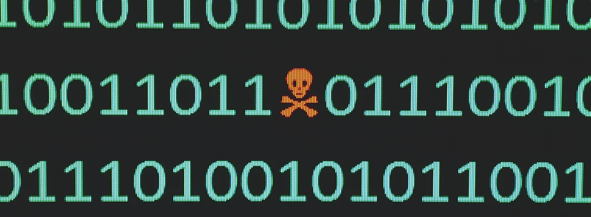

<div id="top"></div>

<div align="center">
 <a href="https://github.com/Link-Wolf/stockholm" title="Go to GitHub repo"></a>
 <a href="https://"></a>
 <a href="https://"></a>
 <a href="https://github.com/Link-Wolf/stockholm/stargazers"></a>
 <a href="https://github.com/Link-Wolf/stockholm/network/members"></a>
 <a href="https://github.com/Link-Wolf/stockholm/issues"></a>
 <a href="https://www.linux.org/" title="Go to Linux homepage"></a>
</div>

<!-- PROJECT LOGO -->
<br />
<div align="center">
  <a>
    
  </a>

  <h3 align="center">Piscine Cybersecurity - stockholm</h3>

  <p align="center">
   <em>Harmless malware</em><br/>
    A ransomware without the ransom
    <br />
    <br />
    <a href="https://github.com/Link-Wolf/stockholm/issues">Report Bug</a>
    ·
    <a href="https://github.com/Link-Wolf/stockholm/issues">Request Feature</a>
  </p>
</div>

<!-- TABLE OF CONTENTS -->
<details>
  <summary>Table of Contents</summary>
  <ol>
    <li>
      <a href="#goal">Goal</a>
    </li>
    <li>
      <a href="#getting-started">Getting Started</a>
      <ul>
        <li><a href="#prerequisites">Prerequisites</a></li>
        <li><a href="#installation">Installation</a></li>
      </ul>
    </li>
    <li><a href="#usage-examples">Usage examples</a></li>
    <li><a href="#contributing">Contributing</a></li>
  </ol>
</details>

<!-- GOAL -->

## Goal

<div align="center">
  <a>
	
  </a>
</div>
</br>

This cybersecurity project aims to understand how a malware works and focus on ransomware.In our case the program will only affect a small portion of the local files.

Since it's only a prototype, there's isn't any ransom to pay to decrypt the files. Plus, the program will only affect the files in the `~/infection` directory and the spread will stay local.

> The program is written in C++

<p align="right">(<a href="#top">back to top</a>)</p>

<!-- GETTING STARTED -->

## Getting Started

Because it's a simple C++ project, there isn't much to say here

> NOTE: Despite the fact that the program is an harmless malware, it's still a malware. So please, don't use it on your computer but on a virtual machine and more importantly don't use it for malicious purposes.

### Prerequisites

Having a C++ compiler like c++

### Installation

1. Clone the repo

    ```sh
    $> git clone https://github.com/Link-Wolf/stockholm.git
    ```

2. Compile the program

    ```sh
    $> cd stockholm
    $> make
    ```

3. Execute it

    ```sh
    $> ./stockholm [(-h|--help)|(-v|--version)] [(-s|--silent)] [(-r|--reverse) KEY]
    ```

    > The `-h` (or `--help`) option is used to display the help message
    > The `-v` (or `--version`) option is used to display the version of the program
    > The `-s` (or `--silent`) option is used to run the program in silent mode and avoid the display of each file affected
    > The `-r` (or `--reverse`) option is used to decrypt the files affected by the program. The `KEY` is the key used to decrypt the files

<p align="right">(<a href="#top">back to top</a>)</p>

<!-- USAGE EXAMPLES -->

## Usage examples


The whole `~/infection` directory is affected by the program


Decrypting the files with the key

<p align="right">(<a href="#top">back to top</a>)</p>

<!-- CONTRIBUTING -->

## Contributing

If you have a suggestion that would make this better, please fork the repo and create a pull request. You can also simply open an issue with the tag "enhancement".
Don't forget to give the project a star! Thanks again!

1. Fork the Project
2. Create your Feature Branch (`git checkout -b feature/AmazingFeature`)
3. Commit your Changes (`git commit -m 'Add some AmazingFeature'`)
4. Push to the Branch (`git push origin feature/AmazingFeature`)
5. Open a Pull Request

<p align="right">(<a href="#top">back to top</a>)</p>
